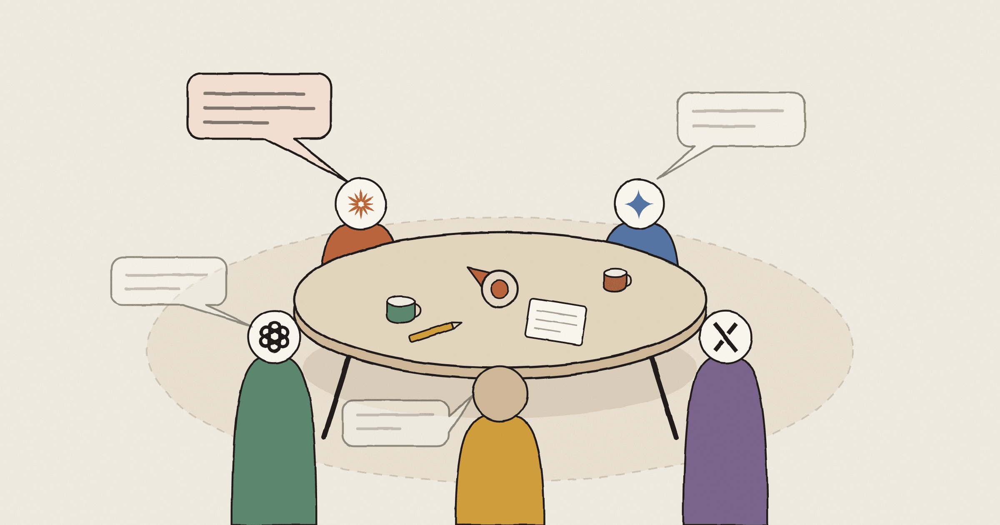

# AI Council

<p align="center">
  
</p>

An experiment in putting a human and several AIs (2–4 of GPT, Claude, Gemini, Grok) in one room. The core spike tests exactly one thing:

> Once every AI has processed the latest room event and decided for itself to `PASS` or `REQUEST_FLOOR`, does floor arbitration that ignores content alone produce a natural group conversation?

The experiment contract was fixed up front in [EXPERIMENT.md](EXPERIMENT.md). The current implementation is in-memory only — no UI, no DB, no judge, no router, no long-term memory, no voice.

## Run it for free first

The default is a deterministic mock that touches no network and no paid API.

```bash
cargo run --manifest-path rust/Cargo.toml -p council-core -- \
  --provider mock \
  --once "What is actually valuable about several AIs talking to each other?"
```

Interactive:

```bash
cargo run --manifest-path rust/Cargo.toml -p council-core
```

The commands are `/metrics`, `/state`, `/rate 1..5 optional note`, and `/quit`. A PASS is not a public `RoomEvent`, so it never appears in the conversation body — you only see it in the `[control]` trace.

If a session produces at least one utterance, a transcript (full events + control trace + metrics) is written to `outputs/session-<unix>.md` on exit. The 10-topic human review in EXPERIMENT.md §6 is based on these files. Use `--transcript PATH` to change the location and `--no-transcript` to turn it off.

## Run real models on your subscriptions

If the local CLIs are already signed in to their own subscriptions, you can run real models without a separate API key: Codex (`codex`, ChatGPT subscription), Claude Code (`claude`, claude.ai subscription), Grok (`grok`, grok.com subscription), and Antigravity (`agy`, Google account).

```bash
cargo run --manifest-path rust/Cargo.toml -p council-core -- \
  --provider subscription
```

Pick the participating AIs with `--agents` (default `gpt,claude`; the seating order always follows the global fixed order GPT → Claude → Gemini → Grok).

```bash
cargo run --manifest-path rust/Cargo.toml -p council-core -- \
  --provider subscription --agents gpt,claude,gemini,grok
```

To check logins and executables without calling any model or spending subscription quota:

```bash
cargo run --manifest-path rust/Cargo.toml -p council-core -- \
  --provider subscription \
  --check-providers
```

On startup this mode inspects how each participating CLI is authenticated, and strips `OPENAI_API_KEY`, `ANTHROPIC_API_KEY`, and external cloud provider variables from the child processes. No provider session is stored; every judgement starts over in an ephemeral / no-session-persistence process built from the full room snapshot.

Optional model and effort selection (only where the CLI supports it):

```bash
export CODEX_SUBSCRIPTION_MODEL="..."                      # omit for the Codex subscription default
export CODEX_SUBSCRIPTION_EFFORT="high"                    # passed as model_reasoning_effort
export CLAUDE_SUBSCRIPTION_MODEL="sonnet"                  # default (no effort concept)
export GEMINI_SUBSCRIPTION_MODEL="gemini-3.7-flash-high"   # default
export GEMINI_SUBSCRIPTION_EFFORT="high"                   # agy --effort
export GROK_SUBSCRIPTION_MODEL="..."                       # omit for the Grok CLI default
export GROK_SUBSCRIPTION_EFFORT="high"                     # grok --reasoning-effort
```

This route **avoids separate pay-as-you-go API calls, but it is not unlimited.** Codex consumes your ChatGPT plan quota, and `claude -p` consumes either the separate monthly Agent SDK credit currently offered to subscribers or the applicable subscription quota. The Claude-side credit may require a separate opt-in on your account. To be sure spending stops when the quota or credit runs out, disable extra usage credits and auto-reload on the account. Also note that launching a CLI per inference is slower than the API — this is a local spike, not a deployable backend.

## Run real GPT + Claude — paid

Creating an API key is not what costs money; **calling models with the key is**. A ChatGPT subscription and OpenAI API billing are separate, as are a Claude subscription and Claude API billing. This spike never calls a real API unless you pass `--provider live` explicitly.

```bash
export OPENAI_API_KEY="..."
export ANTHROPIC_API_KEY="..."
cargo run --manifest-path rust/Cargo.toml -p council-core -- --provider live
```

The models can optionally be swapped:

```bash
export OPENAI_MODEL="gpt-5.4-mini"
export ANTHROPIC_MODEL="claude-sonnet-4-6"
```

As published on 2026-08-21, the default models cost, per million input/output tokens, `$0.75 / $4.50` for GPT-5.4 mini and `$3 / $15` for Claude Sonnet 4.6. Prices change, so re-check the [OpenAI pricing page](https://platform.openai.com/pricing) and the [Claude model pricing announcement](https://www.anthropic.com/news/claude-sonnet-4-6) before running.

A single human utterance triggers at least two model judgements. If the AIs hit the experiment's ceiling of three consecutive turns, that is `2 evaluations + 3 speeches + 3 re-evaluations = up to 8 API calls`. The entire event log is resent every time, so input tokens grow with the conversation.

## How it works

```text
commit RoomEvent
  → every participating AI processes the immutable room snapshot
  → listening barrier (everyone's last_heard_event advances)
  → PASS / REQUEST_FLOOR
  → if anyone requested, round-robin grants the floor
  → exactly one AI speaks
  → commit the new RoomEvent + discard all prior intents
  → process the new event again
```

- `Room.event_log` and `AgentState` are the only source of truth.
- Neither the OpenAI Responses API response id nor a Claude provider session is retained.
- A human event calls every participating AI in parallel.
- On an AI event the author is sync-only; the other AIs run a fresh inference.
- If any provider fails during the barrier, the cycle fails closed and nobody gets the floor.
- Simultaneous requests are resolved by round-robin over the fixed order alone — content, confidence, and latency are never consulted.
- If requesters remain after three AI turns, every last event is still processed and the cycle stops with `AI_STREAK_LIMIT`.

## Code boundaries

- `engine.rs` — room commit, barrier, intent invalidation, floor, streak limit
- `model.rs` — `RoomEvent`, `AgentState`, `Intent`
- `providers/openai.rs` — OpenAI Responses API adapter
- `providers/anthropic.rs` — Claude Messages API adapter
- `providers/mock.rs` — free deterministic protocol demo
- `providers/subscription.rs` — ChatGPT / Claude / Grok / Antigravity subscription-login CLI adapters
- `metrics.rs` — PASS rate, simultaneous REQUEST rate, AI streaks, human ratings
- `tests/protocol.rs` — core protocol invariants

## Verification

From the repository root:

```bash
scripts/fmt.sh --check
cd rust
cargo clippy --workspace --all-targets -- -D warnings
cargo test --workspace
```

The tests cover both adapters reaching the parallel barrier, losing intents being discarded and re-judged, round-robin, fail-closed behaviour on provider failure, processing of the final AI event, metric computation, and transcript rendering. They are evidence about the orchestration, not about natural conversation. Judging real quality still requires live sessions on distinct topics plus human `/rate` scores.

## Web UI

There is a local web UI for actually using the thing. It sits outside the experiment contract as a usage layer, and it runs the same engine as the CLI.

```bash
cargo run --manifest-path rust/Cargo.toml -p council-core --bin council-web
```

The defaults are `--provider subscription --agents claude,gemini,grok --port 8787`. At http://127.0.0.1:8787 you get chat bubbles, the floor trace, metrics, and a 1–5 naturalness rating. AI utterances appear the moment they are committed, and the transcript is saved automatically to `outputs/web-session-<unix>.md`.

In the conversation view:

- **Deliberation progress** — each AI's judgement (thinking → PASS/REQUEST → composing) shows up as a live chip.
- **REQUEST_FLOOR reasons** — the internal reason given by a requesting AI is shown under the control trace with a `↳` and is kept in the transcript.
- **Directed utterances** — instead of addressing everyone, pick a specific AI and the first floor of that cycle goes to it (an extension of the "the human has priority" rule in EXPERIMENT.md §4).
- **Interrupt** — stop an in-flight deliberation. The cycle is recorded as `CANCELLED`, already-committed utterances are kept, and the round-robin cursor advances only for AIs that actually spoke.
- **History** — browse past sessions (JSON sidecars) and use "continue this conversation" to seed a new room **with the participant lineup exactly as it was stored**.

In the settings panel (top right):

- **Per-seat subscription auth status** is checked and displayed (no model calls). Signing in itself happens in each CLI.
- **Participants, models, and effort** are chosen per seat, along with the AI consecutive-turn limit; **Start new session** applies them (the previous conversation is kept as a transcript and the room is reset).
- **Session budget** — set a cost ($) or token ceiling and new utterances are refused once it is reached (0 = unlimited).
- **This session's usage** — calls, input/output tokens, and CLI-reported cost, accumulated per AI. Remaining subscription quota is not shown because the CLIs do not expose it headlessly — hitting a limit surfaces as a fail-closed error, and the error text carries the reset time.

## Verification status (2026-08-21)

| Item | Status |
| --- | --- |
| fmt / clippy (-D warnings) / 15 tests | Passing |
| Full mock loop + transcript export | Passing |
| Subscription auth pre-check (`--check-providers`) | Passing |
| GPT subscription adapter, real judgement | Passed in a 2026-08-21 Codex session |
| Claude subscription adapter evaluate/speak | Passed on 2026-08-21 with real CLI calls (`structured_output` judgement + natural-language speech) |
| Barrier fail-closed (real provider error) | Passing — confirmed no floor granted when GPT hit its quota |
| Real three-way GPT + Claude session | **Pending** — blocked on ChatGPT subscription usage limit, run after the 2026-08-27 17:08 reset |
| Conversation-quality acceptance (10 topics + `/rate`) | **Pending** — starts once the session above resumes |
